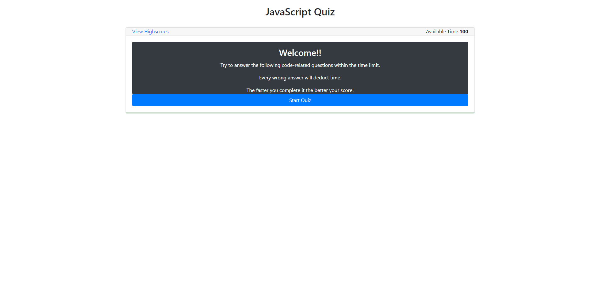
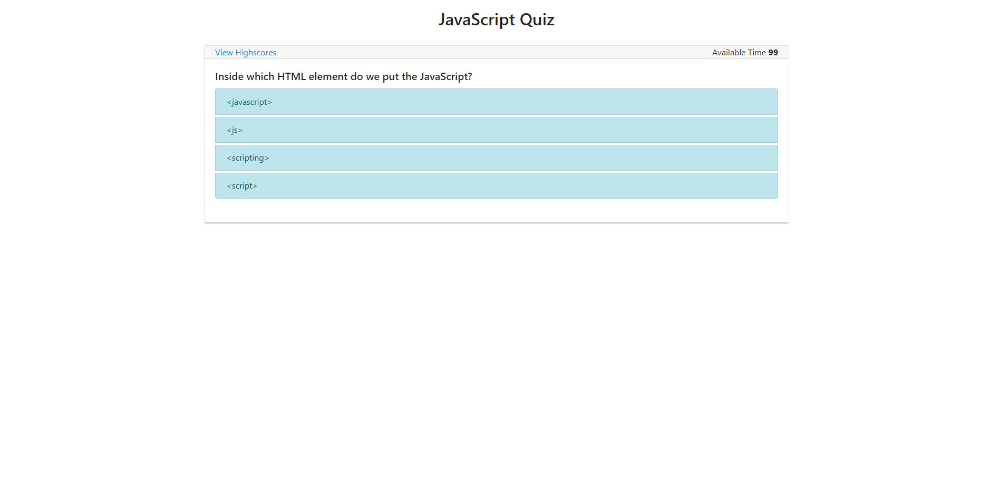
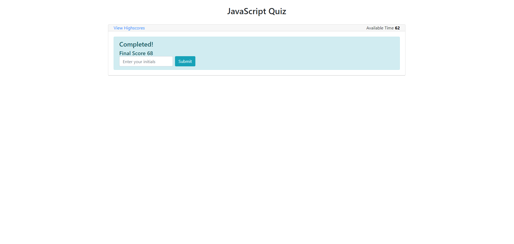
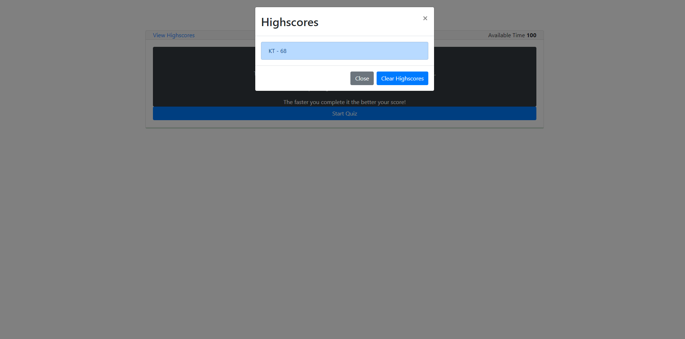

# Time-quiz
- Added Js code to make the js test run

# Usage
1. User is prompted to start test
2. Timer runs down as user tries to complete test for best score
3. User is prompted to save their highscore
4. User can view perivous highscores

# Website
https://kevintulakyan.github.io/Time-quiz/
